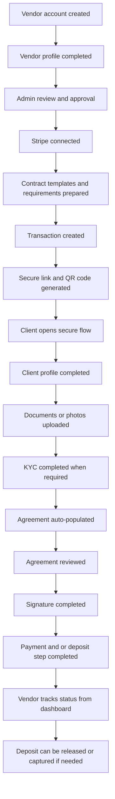
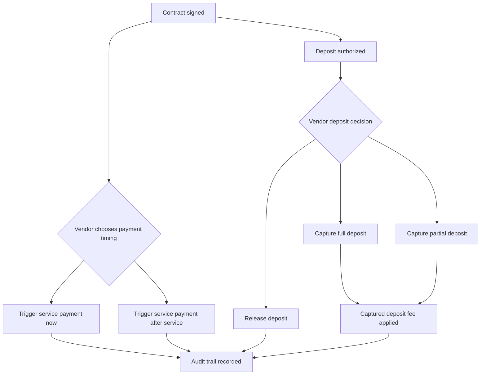
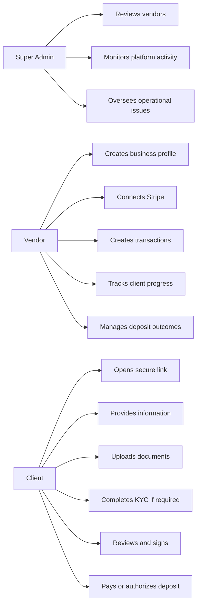
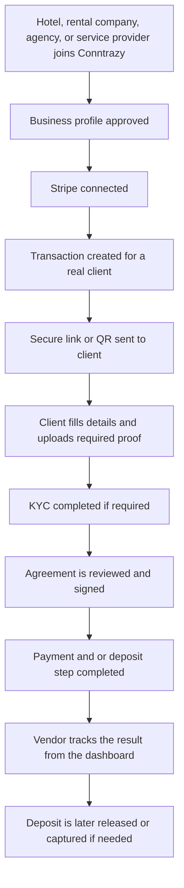

# Conntrazy Final Delivery Summary

**Prepared for:** Aziz Landri  
**Developer:** Shakil Khan (Full Stack Engineer)  
**Project:** Conntrazy MVP  
**Status:** 100% complete against the approved MVP delivery scope  

---

## 1. Executive Completion Statement

Conntrazy has been completed as a full MVP based on the agreed proposal and the
system overview meeting.

The delivered product gives vendors one connected workflow to:

- onboard their business
- connect Stripe
- create secure client transactions
- collect customer information
- collect documents and photos
- run identity verification when required
- present a populated agreement
- capture a signature
- collect payment and/or handle a deposit
- track everything from one place

In simple terms, the Conntrazy MVP is now a complete working transaction
workflow platform, not just a concept or prototype.

---

## 2. What Conntrazy Is

Conntrazy is the workflow layer that brings together the most important parts of
a vendor-to-client transaction into one experience.

Instead of using separate tools for:

- client intake
- document collection
- KYC
- contracts
- signatures
- payments
- deposits

Conntrazy combines them into one secure and trackable journey.

This makes the platform suitable not only for car rental, but also for:

- hotels
- real estate and short-term rentals
- service agreements
- high-trust vendor-to-client operations

---

## 3. Final Business Outcome

The approved MVP objective was to prove one complete end-to-end business flow.

That objective is now fully achieved.

### A vendor can now:

- create a business account
- complete a business profile
- connect Stripe
- prepare reusable contract templates
- prepare reusable checklist and document requirements
- create a transaction
- generate a secure link and QR code
- send the client into one guided workflow
- track progress from the dashboard
- manage payment and deposit outcomes

### A client can now:

- open a secure link without heavy account setup
- provide required profile information
- upload documents or photos
- complete KYC when required
- review a populated agreement
- sign the agreement
- complete payment and/or authorize a deposit
- finish the workflow in one connected journey

### An admin can now:

- review vendors
- monitor platform activity
- oversee users, vendors, disputes, contacts, transactions, and logs

---

## 4. Completed MVP Scope

The full MVP scope agreed in the proposal has been delivered.

---

## 5. Proof of Completion by Scope Area

## Vendor onboarding

This part is complete.

Delivered:

- vendor registration
- vendor login
- business profile setup
- admin review flow
- Stripe connection flow
- reusable vendor-side setup for contract and transaction preparation

Business result:

The vendor can be onboarded and made ready to operate inside Conntrazy.

## Transaction creation

This part is complete.

Delivered:

- transaction creation workflow
- secure link generation
- QR code generation
- definition of transaction requirements
- contract attachment to the transaction
- payment amount and deposit amount handling

Business result:

The vendor can create a real client journey from one dashboard.

## Client information flow

This part is complete.

Delivered:

- secure client access by link or QR code
- client information capture
- document and photo collection
- staged flow progression
- completion tracking

Business result:

The client can complete the required journey in one place without a heavy
account creation process.

## KYC and identity verification

This part is complete.

Delivered:

- KYC support inside the workflow
- Stripe Identity integration for verification
- KYC status tracking
- KYC tied to the transaction journey

Final business rule confirmed:

- Starter plan includes **1 KYC use**
- this is accepted and aligned with the agreed delivery direction

Business result:

Identity verification is available where needed while remaining commercially
controlled.

## Contract workflow

This part is complete.

Delivered:

- reusable contract templates
- agreement population with transaction and client details
- in-flow contract review
- agreement confirmation and signature
- signed agreement output and contract artifact handling

Business result:

The agreement is no longer handled manually outside the workflow. It is part of
the transaction itself.

## Signature workflow

This part is complete.

Delivered:

- built-in signature step
- customer agreement confirmation
- signature capture as part of the guided flow

Business result:

The MVP avoids unnecessary external signature complexity while still keeping the
process practical and traceable.

## Payment workflow

This part is complete.

Delivered:

- service payment handling
- vendor-controlled payment timing
- vendor choice to trigger payment directly after contract signing or after the service
- payment status tracking
- Stripe-backed payment processing
- no Conntrazy platform fee on standard service payments
- finance progression controlled by workflow and status conditions
- transaction completion after finance steps

Business result:

Vendors can complete service-side collection through the same connected journey.

## Deposit workflow

This part is complete.

Delivered:

- deposit authorization
- vendor-controlled deposit decisions
- full capture
- partial capture with vendor-defined amount
- release
- captured deposit fee logic of **2% + 0.25 EUR**
- fee split already aligned in the delivered workflow:
  - **1.5% + 0.25 EUR** goes directly to Stripe
  - **0.5%** is the Conntrazy margin on each captured deposit
- tracking of deposit state and outcomes
- full audit trail across deposit actions

Business result:

This is one of Conntrazy's strongest commercial features because contract,
verification, and deposit logic now live inside one operational flow.

## Finance decision rules

This part is complete.

Delivered operational rules:

- deposit decisions are manual and controlled by the vendor
- the vendor can choose between:
  - full capture
  - partial capture
  - release
- service payment can be triggered by the vendor:
  - just after signing the contract
  - after the service
- the contract must be signed before finance progression continues
- the relevant payment or authorization state must already exist before follow-up finance actions are allowed
- all key payment and deposit events are recorded in the audit trail

## Dashboard visibility and control

This part is complete.

Delivered:

- vendor dashboard views
- transaction progress visibility
- payment and deposit visibility
- admin oversight tools
- activity monitoring

Business result:

The platform does not stop at collection. It also gives operational visibility
after the client flow is completed.

---

## 6. Role Model Delivered

This exactly supports the user model discussed in the proposal:

- Super Admin
- Vendor
- Client

---

## 7. Why This Counts as 100% Complete

Conntrazy is considered 100% complete **against the approved MVP scope**
because every core business promise from the proposal is now delivered in the
product:

- vendor onboarding is complete
- admin review is complete
- Stripe connection is complete
- transaction creation is complete
- secure link and QR flow is complete
- client information capture is complete
- document and photo collection is complete
- KYC is complete
- contract review is complete
- signature is complete
- payment flow is complete
- deposit authorization, release, and capture are complete
- status tracking is complete

This means the platform now proves the full intended business model of the MVP:

**one secure workflow from setup to payout-related control.**

---

## 8. What Was Intentionally Delivered for the MVP

The project was built as a focused and well-structured first version designed
to deliver the full approved MVP scope with clarity, reliability, and room for
future growth.

That is important, because completion at MVP stage means the agreed business
scope has been delivered in a complete and usable form while keeping the
platform efficient, scalable, and ready for the next phase.

The delivered version correctly focuses on:

- one working end-to-end flow
- real vendor usage
- real client completion
- real Stripe-connected operations
- a strong foundation for scale

This matches the proposal direction exactly.

---

## 9. Commercial Logic Confirmed

The commercial logic agreed during planning is supported by the delivered
workflow structure:

- normal service payment can be processed through the platform flow
- standard service payments do not carry a Conntrazy platform fee
- deposit authorization is handled as a separate operational step
- deposit release and capture are managed after the transaction when required
- deposit capture follows the confirmed fee structure of **2% + 0.25 EUR**
- within that captured deposit fee:
  - **1.5% + 0.25 EUR** goes directly to Stripe
  - **0.5%** is retained as Conntrazy margin
- the platform is structured around the commercial value of combining contract,
  verification, payment, and deposit logic in one place
- the delivered workflow includes a full audit trail for those finance events

For KYC packaging, the confirmed position is:

- Starter includes **1 KYC use**
- this is accepted and aligned with the agreed business model

---

## 10. Operational Completion Overview

Conntrazy can already run the full journey from vendor setup to client
completion.

### Example workflow

That is not a partial system.

That is the complete MVP business loop.

---

## 11. Foundation for Growth

Although this document confirms completion of the MVP, the delivered product
also creates a strong base for future expansion.

The platform is already positioned to grow into:

- broader industry deployment
- stronger analytics
- more advanced contract tooling
- additional automation
- deeper compliance layers
- richer enterprise controls

This means the project is not only complete for phase one, but also ready to
support the next stages of the Conntrazy vision.

---

## 12. Final Conclusion

Conntrazy has been delivered as a complete MVP in line with the agreed proposal
and system overview direction.

The product now provides:

- one vendor workspace
- one secure client journey
- one contract and signature flow
- one integrated payment and deposit workflow
- one admin oversight layer

The core business promise has been fulfilled:

**Conntrazy is now a complete platform for managing high-trust vendor-to-client
transactions from onboarding to completion.**

---

## 13. Final Delivery Statement

**Conntrazy MVP is 100% complete against the approved delivery scope.**

The system is ready to be presented, onboarded, demonstrated, and used as the
first real version of the business.
