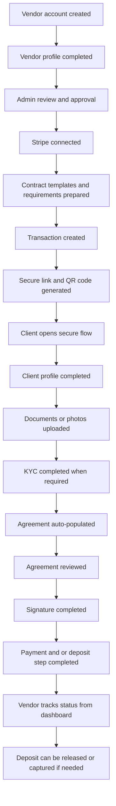
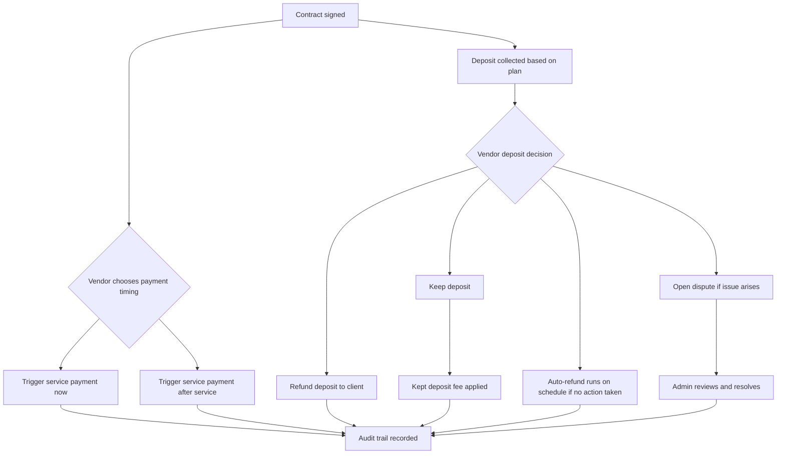
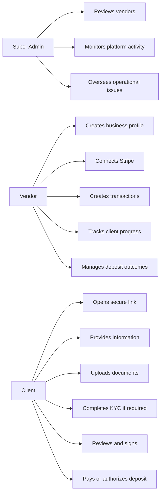
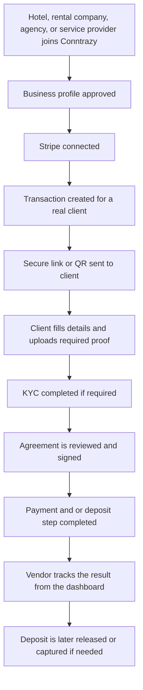

# Conntrazy Final Delivery Summary

**Prepared for:** Aziz Landri  
**Developer:** Shakil Khan (Full Stack Engineer)  
**Project:** Conntrazy MVP  
**Status:** 100% complete against the approved MVP delivery scope, with the
latest core operational updates integrated into the live product  

---

## 1. Executive Completion Statement

Conntrazy has been completed as a full MVP based on the agreed proposal and the
system overview meeting.

Since the initial MVP completion, the live product has also been strengthened
with key production updates around shareable link and QR delivery, revisitable
pre-payment onboarding steps, safer document lifecycle cleanup, vendor export
tools, secure signature image preview, plan-based deposit strategies, automatic
deposit refund scheduling, and a fully integrated dispute resolution flow.

The delivered product gives vendors one connected workflow to:

- onboard their business
- connect Stripe
- create secure client transactions
- collect customer information
- collect documents and photos
- run identity verification when required
- present a populated agreement
- capture a signature
- collect payment and/or handle a deposit
- track everything from one place

In simple terms, the Conntrazy MVP is now a complete working transaction
workflow platform, not just a concept or prototype.

---

## 2. What Conntrazy Is

Conntrazy is the workflow layer that brings together the most important parts of
a vendor-to-client transaction into one experience.

Instead of using separate tools for:

- client intake
- document collection
- KYC
- contracts
- signatures
- payments
- deposits

Conntrazy combines them into one secure and trackable journey.

This makes the platform suitable not only for car rental, but also for:

- hotels
- real estate and short-term rentals
- service agreements
- high-trust vendor-to-client operations

---

## 3. Final Business Outcome

The approved MVP objective was to prove one complete end-to-end business flow.

That objective is now fully achieved.

### A vendor can now:

- create a business account
- complete a business profile
- connect Stripe
- prepare reusable contract templates
- prepare reusable checklist and document requirements
- create a transaction
- generate a secure link and QR code
- share that link or QR through copy, email, WhatsApp, Facebook, or downloadable QR image
- send the client into one guided workflow
- track progress from the dashboard
- export operational records from key vendor tables
- manage payment and deposit outcomes

### A client can now:

- open a secure link without heavy account setup
- provide required profile information
- upload documents or photos
- complete KYC when required
- review a populated agreement
- sign the agreement
- go back and update earlier steps before payment begins
- complete payment and/or authorize a deposit
- finish the workflow in one connected journey

### An admin can now:

- review vendors
- monitor platform activity
- oversee users, vendors, disputes, contacts, transactions, and logs

---

## 4. Completed MVP Scope

The full MVP scope agreed in the proposal has been delivered.

---

## 5. Proof of Completion by Scope Area

## Vendor onboarding

This part is complete.

Delivered:

- vendor registration
- vendor login
- business profile setup
- admin review flow
- Stripe connection flow
- reusable vendor-side setup for contract and transaction preparation

Business result:

The vendor can be onboarded and made ready to operate inside Conntrazy.

## Transaction creation

This part is complete.

Delivered:

- transaction creation workflow
- secure link generation
- QR code generation
- final-step sharing for link distribution by copy, email, WhatsApp, and Facebook
- QR download and sharing as a real image
- definition of transaction requirements
- contract attachment to the transaction
- payment amount and deposit amount handling

Business result:

The vendor can create and distribute a real client journey from one dashboard.

## Client information flow

This part is complete.

Delivered:

- secure client access by link or QR code
- client information capture
- document and photo collection
- revisitable pre-payment steps for profile, documents, identity, contract, and signature
- saved document state reloaded when the client returns to a previous step
- secure replace and delete handling with cleanup of obsolete Cloudinary files
- staged flow progression
- completion tracking

Business result:

The client can complete the required journey in one place without a heavy
account creation process, while still being able to correct information before
finance begins.

## KYC and identity verification

This part is complete.

Delivered:

- KYC support inside the workflow
- Stripe Identity integration for verification
- KYC status tracking
- KYC tied to the transaction journey
- ability to continue forward when identity verification is already satisfied
- controlled restart of identity verification before payment when a fresh check is required

Final business rule confirmed:

- Starter plan includes **1 KYC use**
- this is accepted and aligned with the agreed delivery direction

Business result:

Identity verification is available where needed while remaining commercially
controlled.

## Contract workflow

This part is complete.

Delivered:

- reusable contract templates
- agreement population with transaction and client details
- in-flow contract review
- agreement confirmation and signature
- signed agreement output and contract artifact handling
- contract step can be revisited before payment if upstream data needs to be corrected

Business result:

The agreement is no longer handled manually outside the workflow. It is part of
the transaction itself.

## Signature workflow

This part is complete.

Delivered:

- built-in signature step
- customer agreement confirmation
- signature capture as part of the guided flow
- ability to revisit and update the signature before any payment or deposit step begins

Business result:

The MVP avoids unnecessary external signature complexity while still keeping the
process practical and traceable.

## Payment workflow

This part is complete.

Delivered:

- service payment handling
- card-only collection flow for the live payment experience
- vendor-controlled payment timing
- vendor choice to trigger payment directly after contract signing or after the service
- payment status tracking
- Stripe-backed payment processing
- no Conntrazy platform fee on standard service payments
- finance progression controlled by workflow and status conditions
- transaction completion after finance steps

Business result:

Vendors can complete service-side collection through the same connected journey.

## Deposit workflow

This part is complete.

Conntrazy now supports two deposit models, assigned automatically based on the
vendor's plan. Each model has been designed to give both vendors and clients a
clear, professional experience.

**Starter — card hold model (7 days)**

The customer's card is pre-authorised. No money is moved until the vendor
decides to keep or release the deposit. The vendor has 7 days to make that
decision. If no action is taken, the hold expires automatically on the card
network.

**Pro — charge and scheduled refund model (14 days)**

The deposit is charged to the customer's card immediately when they complete
the payment step. A full automatic refund is scheduled for day 14. The vendor
can keep the deposit before that date, or refund it early. If the vendor takes
no action, the platform issues the refund automatically on schedule.

**Business — charge and scheduled refund model (30 days)**

The same model as Pro, with a 30-day window instead of 14.

Delivered across both models:

- vendor-controlled deposit decisions: keep or refund
- partial capture option for Starter plan vendors
- automatic refund scheduling and execution for Pro and Business plans
- dispute flow that works correctly for both deposit models
- deposit fee logic of **2% + 0.25 EUR** on kept deposits only
- fee split aligned in the delivered workflow:
  - **1.5% + 0.25 EUR** goes directly to Stripe
  - **0.5%** is the Conntrazy margin on each kept deposit
- no fee applied on released or refunded deposits
- tracking of deposit state and outcomes
- full audit trail across all deposit actions
- email notifications at every key stage for both vendor and client

Business result:

This is one of Conntrazy's strongest commercial features. The platform now
handles both the simple hold model and the more powerful charge-and-refund
model within the same operational flow, giving vendors real commercial
flexibility without added complexity.

## Finance decision rules

This part is complete.

Delivered operational rules:

- before any payment or deposit starts, earlier onboarding steps can be revisited and corrected
- once service payment or deposit flow begins, earlier onboarding routes are locked
- deposit decisions are controlled by the vendor
- the vendor can choose between:
  - keep the deposit (full or partial for Starter; full for Pro and Business)
  - refund the deposit early
  - let the platform auto-refund on schedule (Pro and Business only)
- service payment can be triggered by the vendor:
  - just after signing the contract
  - after the service
- the contract must be signed before finance progression continues
- disputed transactions are protected — deposit decisions are suspended until the dispute is resolved
- all key payment and deposit events are recorded in the audit trail

## Dashboard visibility and control

This part is complete.

Delivered:

- vendor dashboard views
- transaction progress visibility
- payment and deposit visibility
- CSV export for links, transactions, clients, KYC, and signatures
- secure preview of stored signature images from the signatures workspace
- admin oversight tools
- activity monitoring

Business result:

The platform does not stop at collection. It also gives operational visibility
after the client flow is completed.

---

## 6. Role Model Delivered

This exactly supports the user model discussed in the proposal:

- Super Admin
- Vendor
- Client

---

## 7. Why This Counts as 100% Complete

Conntrazy is considered 100% complete **against the approved MVP scope**
because every core business promise from the proposal is now delivered in the
product:

- vendor onboarding is complete
- admin review is complete
- Stripe connection is complete
- transaction creation is complete
- secure link and QR flow is complete
- client information capture is complete
- document and photo collection is complete
- KYC is complete
- contract review is complete
- signature is complete
- payment flow is complete
- deposit workflow with two plan-based models is complete
- automatic deposit refund scheduling is complete
- dispute flow for both deposit models is complete
- status tracking is complete

This means the platform now proves the full intended business model of the MVP:

**one secure workflow from setup to payout-related control.**

---

## 8. What Was Intentionally Delivered for the MVP

The project was built as a focused and well-structured first version designed
to deliver the full approved MVP scope with clarity, reliability, and room for
future growth.

That is important, because completion at MVP stage means the agreed business
scope has been delivered in a complete and usable form while keeping the
platform efficient, scalable, and ready for the next phase.

The delivered version correctly focuses on:

- one working end-to-end flow
- real vendor usage
- real client completion
- real Stripe-connected operations
- a strong foundation for scale

The current live version also includes core operational refinements beyond the
baseline MVP, especially around reporting, shareability, data correction before
payment, and safer asset handling.

This matches the proposal direction exactly.

---

## 9. Commercial Logic Confirmed

The commercial logic agreed during planning is supported by the delivered
workflow structure:

- the current live payment experience is standardized on card payments
- normal service payment can be processed through the platform flow
- standard service payments do not carry a Conntrazy platform fee
- deposit is handled as a separate step tied to the vendor's plan

**Plan-based deposit models:**

- **Starter** — 7-day card hold. The customer's card is pre-authorised and no
  money is moved until the vendor acts. The vendor can keep (full or partial)
  or release the deposit within 7 days.

- **Pro** — 14-day charge and refund. The deposit is charged to the customer
  immediately and automatically refunded after 14 days unless the vendor
  keeps it first.

- **Business** — 30-day charge and refund. Same model as Pro with a 30-day
  window.

**Fee structure:**

- keeping a deposit follows the confirmed fee structure of **2% + 0.25 EUR**
- within that fee:
  - **1.5% + 0.25 EUR** goes directly to Stripe
  - **0.5%** is retained as Conntrazy margin
- no fee is applied when a deposit is released or refunded
- for Pro and Business plans, the platform fee is returned automatically if
  the deposit is refunded

**Dispute handling:**

- vendors can open a dispute on any active transaction with an active deposit
- this works correctly for both deposit models
- the admin reviews the case and either returns deposit control to the vendor
  or releases the deposit to the client
- disputed transactions are fully protected — no automatic refund or deposit
  action runs while a dispute is open

- the platform is structured around the commercial value of combining contract,
  verification, payment, and deposit logic in one connected place
- the delivered workflow includes a full audit trail for all finance events

For KYC packaging, the confirmed position is:

- Starter includes **1 KYC use**
- this is accepted and aligned with the agreed business model

---

## 10. Operational Completion Overview

Conntrazy can already run the full journey from vendor setup to client
completion.

### Example workflow

That is not a partial system.

That is the complete MVP business loop.

---

## 11. Foundation for Growth

Although this document confirms completion of the MVP, the delivered product
also creates a strong base for future expansion.

The platform is already positioned to grow into:

- broader industry deployment
- stronger analytics
- more advanced contract tooling
- additional automation
- deeper compliance layers
- richer enterprise controls

This means the project is not only complete for phase one, but also ready to
support the next stages of the Conntrazy vision.

---

## 12. Final Conclusion

Conntrazy has been delivered as a complete MVP in line with the agreed proposal
and system overview direction.

The product now provides:

- one vendor workspace
- one secure client journey
- one contract and signature flow
- one integrated payment and deposit workflow
- one admin oversight layer

The core business promise has been fulfilled:

**Conntrazy is now a complete platform for managing high-trust vendor-to-client
transactions from onboarding to completion.**

---

## 13. Final Delivery Statement

**Conntrazy MVP is 100% complete against the approved delivery scope.**

The system is ready to be presented, onboarded, demonstrated, and used as the
first real version of the business.
