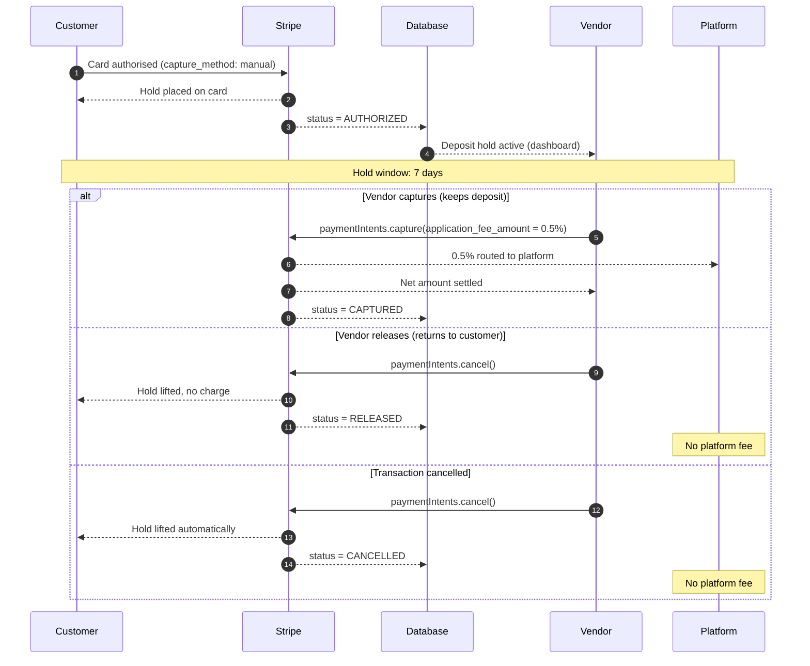
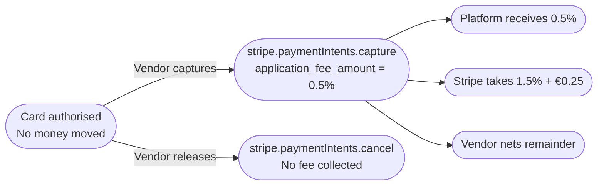
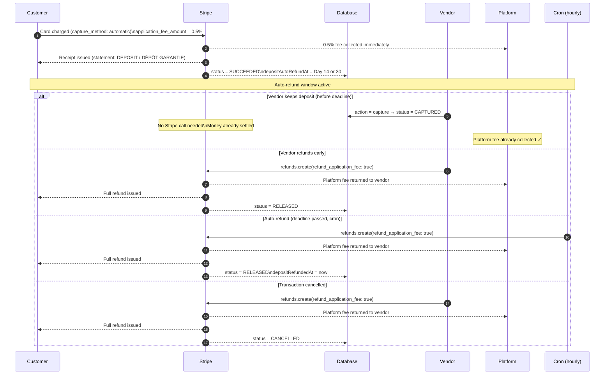
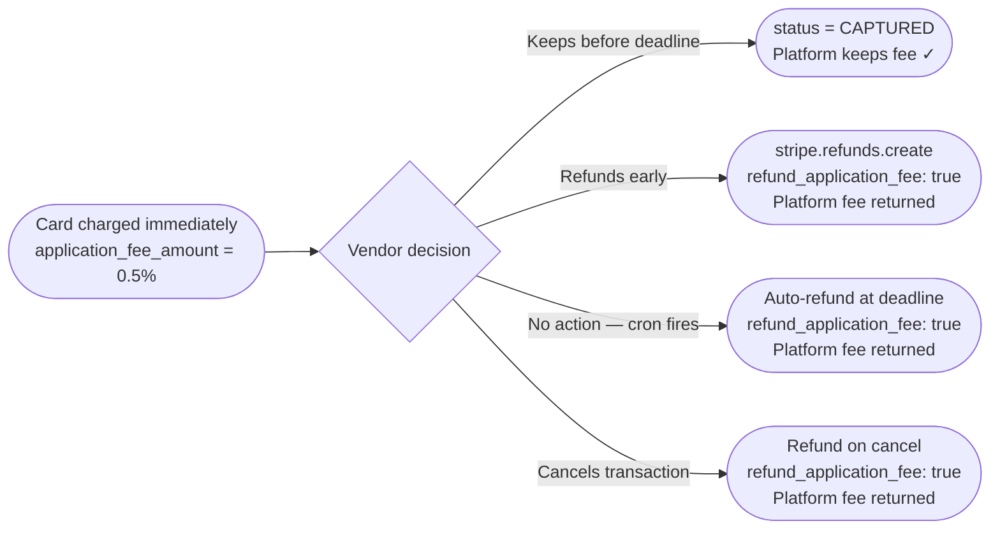
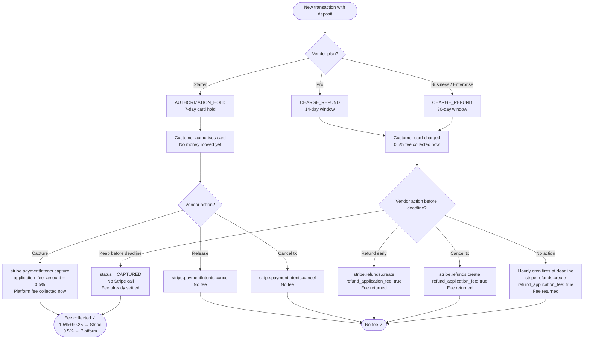
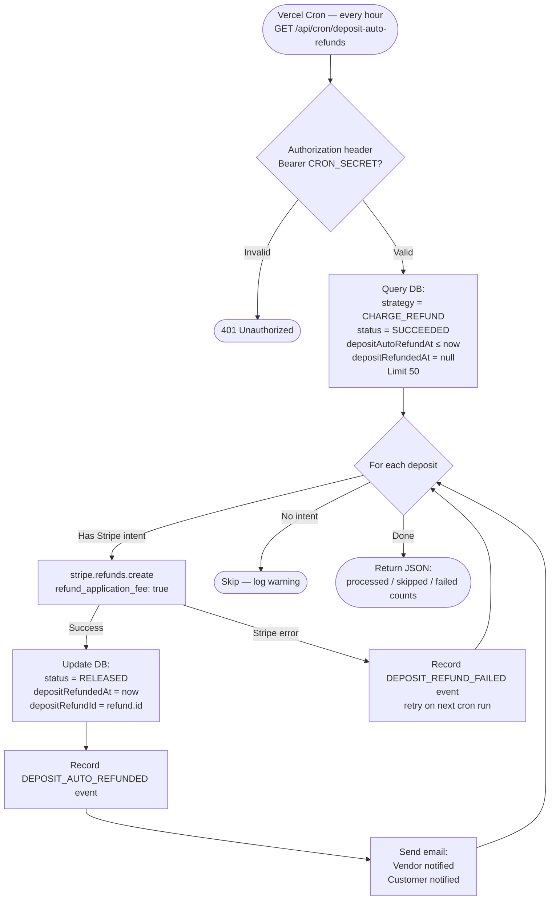
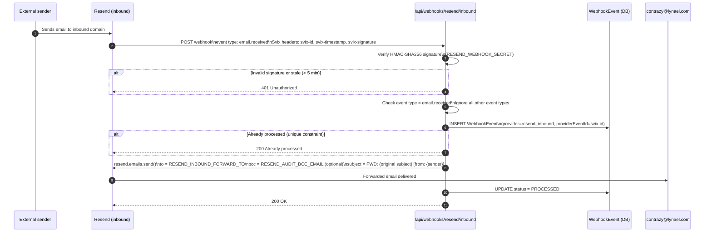
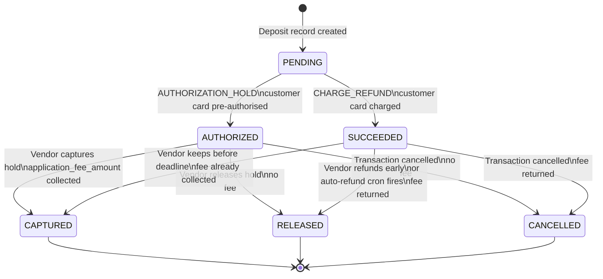

# Conntrazy — Deposit & Fee Flow

> **Audience:** Internal / client showcase  
> **Last updated:** 2026-05-13  
> **Scope:** Security-deposit lifecycle, fee collection, auto-refund automation, and Resend inbound forwarding

---

## 1. Deposit Strategy by Plan

Every transaction that includes a security deposit follows one of two strategies, assigned automatically based on the vendor's active subscription plan.

| Plan | Strategy | Window | Platform fee |
|------|----------|--------|--------------|
| **Starter** | `AUTHORIZATION_HOLD` | 7 days | Only on capture |
| **Pro** | `CHARGE_REFUND` | 14 days | Collected at charge, returned on refund |
| **Business** | `CHARGE_REFUND` | 30 days | Collected at charge, returned on refund |
| **Enterprise** | `CHARGE_REFUND` | 30 days | Collected at charge, returned on refund |

> **AUTHORIZATION_HOLD** — Stripe places a temporary hold on the customer's card. Money is never moved until the vendor explicitly captures it.  
> **CHARGE_REFUND** — Stripe immediately charges the customer's card. An automatic refund is issued at the end of the window unless the vendor decides to keep the deposit.

---

## 2. Fee Structure

```
Total cost to vendor on a captured deposit
──────────────────────────────────────────
Stripe processing fee   1.5% + €0.25   (deducted by Stripe)
Platform margin         0.5%            (collected by Conntrazy)
                        ─────────────────────────────────────
Total fee on capture    ≈ 2% + €0.25

Example — €1,000 deposit captured in full:
  Stripe fee        €15.25
  Platform fee      €5.00
  Vendor receives   €979.75

No fee on:  release · refund · cancellation · service payments
```

---

## 3. Strategy A — AUTHORIZATION_HOLD (Starter)

### How it works

The customer's card is pre-authorised. Stripe never moves money until the vendor triggers a capture. No platform fee is charged unless the deposit is captured.



### Fee collection point



---

## 4. Strategy B — CHARGE_REFUND (Pro / Business)

### How it works

The customer's card is charged immediately (automatic capture). The platform fee is collected upfront via `application_fee_amount`. An auto-refund is scheduled for day 14 (Pro) or day 30 (Business). The vendor can override at any time before the deadline.



### Fee collection point



---

## 5. Complete Decision Flow (Both Strategies)



---

## 6. Auto-Refund Cron Job

The cron runs **every hour** via Vercel's built-in scheduler. It processes at most 50 overdue deposits per run to respect the function timeout.



> **Retry behaviour:** If a refund fails (network error, Stripe error), it is not retried in the same run. The deposit remains `status = SUCCEEDED` with `depositRefundedAt = null`, so the next hourly cron picks it up automatically.

---

## 7. Resend Inbound Email Forwarding

Any email received at the configured Resend inbound domain is verified and forwarded to `contrazy@lynael.com`.



---

## 8. Database State Machine



---

## 9. Event Log (TransactionEvent)

Every state change produces an immutable event record with a `dedupeKey` to prevent duplicates.

| Event type | Triggered by | Strategy |
|------------|-------------|----------|
| `DEPOSIT_AUTHORIZED` | Customer completes auth hold | AUTHORIZATION_HOLD |
| `DEPOSIT_CHARGED` | Customer card charged | CHARGE_REFUND |
| `DEPOSIT_CAPTURED` | Vendor captures / keeps | Both |
| `DEPOSIT_RELEASED` | Vendor releases / refunds | Both |
| `DEPOSIT_AUTO_REFUNDED` | Cron auto-refund | CHARGE_REFUND |
| `DEPOSIT_AUTO_REFUND_SKIPPED` | Cron skips (missing intent) | CHARGE_REFUND |
| `DEPOSIT_REFUND_FAILED` | Stripe refund error | CHARGE_REFUND |
| `TRANSACTION_CANCELLED` | Transaction cancelled | Both |

---

## 10. Email Notifications

| Trigger | Recipients | Template |
|---------|-----------|----------|
| Deposit authorized (hold) | Vendor | `sendVendorDepositAlert` |
| Deposit charged | Customer | `sendDepositChargedEmail` |
| Vendor captures | Vendor + Customer | `sendVendorDepositStatusEmail` + `sendCustomerDepositStatusEmail` |
| Vendor releases | Vendor + Customer | `sendVendorDepositStatusEmail` + `sendCustomerDepositStatusEmail` |
| Auto-refund | Customer | `sendDepositAutoRefundedEmail` |
| Inbound email received | `contrazy@lynael.com` | Forwarded via Resend |

---

## 11. Environment Variables Required

```env
# Deposit cron authentication
CRON_SECRET=<random 32+ byte hex>

# Resend inbound email forwarding
RESEND_WEBHOOK_SECRET=whsec_...          # From Resend dashboard → Webhooks
RESEND_INBOUND_FORWARD_TO=contrazy@lynael.com
RESEND_AUDIT_BCC_EMAIL=                  # Optional — BCC on every forwarded email
```

> **Vercel Dashboard:** Add `CRON_SECRET` as a Production environment variable. Vercel injects it automatically as the `Authorization: Bearer` header on every cron invocation.

---

## 12. Security Guarantees

| Concern | Mitigation |
|---------|-----------|
| Cron endpoint called by anyone | `Authorization: Bearer CRON_SECRET` header required; 401 otherwise |
| Resend webhook replayed | Svix HMAC-SHA256 signature verified; events older than 5 min rejected |
| Duplicate webhook delivery | `WebhookEvent` unique constraint on `(provider, providerEventId)` |
| Double refund | Cron checks `depositRefundedAt IS NULL` before acting |
| Platform fee not collected on keep | `application_fee_amount` set at PaymentIntent creation for CHARGE_REFUND; Stripe guarantees it |
| Platform fee charged on release | `refund_application_fee: true` on every CHARGE_REFUND refund |
| Secrets in logs | No payment secrets, keys, or webhook bodies logged in production paths |
